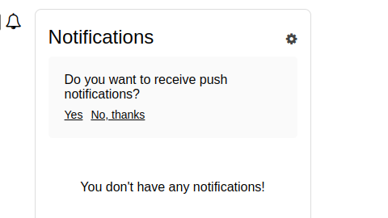
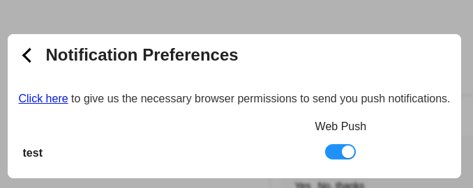
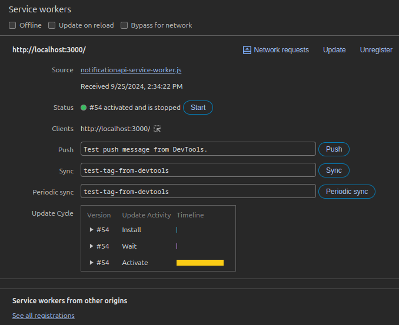

# 🌐 Setup Web Push

import webPushWorkflow from '@site/static/webPushWorkflow.png';

Web Push Notifications allow you to engage users directly through their web browsers, even when they're not on your website. This guide will walk you through setting up Web Push Notifications using NotificationAPI.

## Overview

To set up Web Push Notifications with NotificationAPI, you'll need to:

1. **Create a Notification Template** in the NotificationAPI Dashboard.
2. **Implement the Frontend SDK** on your website.
3. **Set Up the Service Worker**.
4. **Send Notifications from the Backend** using NotificationAPI's Backend SDKs.

## Schematic Diagram

Below is a detailed schematic that breaks down each step:


**Steps Explained**:

1. **User Visits Website**: The user navigates to your website using their browser.
2. **Frontend SDK Initialization**: The website loads the Frontend SDK, which initializes and registers the service worker.
3. **Service Worker Registration**: The service worker is essential for handling background tasks and notifications.
4. **User Permission Prompt**: The SDK prompts the user to grant permission for notifications.
5. **User Subscribes**: Upon granting permission, the user is subscribed to receive notifications.
6. **Backend Sends Notification**: An event in your system triggers the backend to send a notification via NotificationAPI.
7. **Notification Dispatch**: NotificationAPI processes the request and dispatches the notification to the user's browser.
8. **Browser Receives Notification**: The service worker receives the notification in the background.
9. **Notification Displayed**: The browser displays the notification to the user, even if they're not on your website.

---

## Step-by-Step Implementation

**Step 1: Create a Notification Template**

1. Log in to the NotificationAPI Dashboard.
2. Create a new notification template.
3. Enable "Web Push" as a channel.
4. Customize the template to suit your needs.

---

**Step 2: Implement the Frontend SDK**

Integrate the NotificationAPI Frontend SDK into your web page to handle user subscriptions and display notifications.

**_Setup & Initialization_**:
Choose between installing via a package manager or including the SDK directly in your HTML.

import Tabs from '@theme/Tabs';
import TabItem from '@theme/TabItem';

<Tabs
groupId="package-manager"
defaultValue="manager"
values={[
{ label: 'Package Manager', value: 'manager' },
{ label: 'UMD', value: 'umd' }
]
}>
<TabItem value="manager">

```shell title="1. Install"
npm install notificationapi-js-client-sdk
# yarn add notificationapi-js-client-sdk
# pnpm add notificationapi-js-client-sdk
```

```js title="2. Import"
import NotificationAPI from 'notificationapi-js-client-sdk';
import 'notificationapi-js-client-sdk/dist/styles.css';
```

```js title="3. Initialize"
const notificationapi = new NotificationAPI({
  clientId: 'YOUR_CLIENT_ID',
  userId: 'UNIQUE_USER_ID'
});
```

</TabItem>
<TabItem value="umd">

```html title="1. Add to HTML, before </head>"
<script src="https://unpkg.com/notificationapi-js-client-sdk@4.4.0/dist/notificationapi-js-client-sdk.js"></script>
<link
  href="https://unpkg.com/notificationapi-js-client-sdk/dist/styles.css"
  rel="stylesheet"
/>
```

```js title="2. Initialize"
const notificationapi = new NotificationAPI({
  clientId: YOUR_CLIENT_ID,
  userId: UNIQUE_USER_ID
});
```

</TabItem>
</Tabs>

#### Parameters

| Parameter               | Type   | Description                                                                                                                                |
| ----------------------- | ------ | ------------------------------------------------------------------------------------------------------------------------------------------ |
| clientId\*              | string | Your NotificationAPI account clientId. You can get it from [here](https://app.notificationapi.com/environments).                           |
| userId\*                | string | The unique ID of the user in your system.                                                                                                  |
| userIdHash              | string | Only used for [Secure Mode](#secure-mode).                                                                                                 |
| websocket               | string | Only if you want to specify your region, for example, if your account is in Canada region you must pass 'wss://ws.ca.notificationapi.com'. |
| language                | string | The language used for the pre-built UI widgets. Supported: `en-US`, `es-ES`, `fr-FR`, `it-IT`, `pt-BR`                                     |
| customServiceWorkerPath | string | Path to your service worker file if it's not at the root (e.g., '/custom/path/notificationapi-service-worker.js').                         |

<sup>\*</sup> Required parameters

For more information please checkout our [vanilla JS SDK](../reference/js-client#setup--initialization) guid.

**Step 3: Service Worker Setup**

The service worker manages background tasks and is essential for receiving push notifications.

1. **Download** the notificationapi-service-worker.js file.
2. **Place the file** in the `public` folder of your web application. It should be accessible at `https://yourdomain.com/notificationapi-service-worker.js`.
3. **Update the SDK Initialization**: If the service worker is not at the root, specify its path using the `customServiceWorkerPath` parameter during SDK initialization.

---

**Step 4: Give permission On your browser**

**Option 1: Rely on NotificationAPI Pre-Built component (Recommended)**
If you are using our front-end SDK to show in-app notifications. You can simply rely on our SDK to ask your users to opt in for web push notification.

1. Click on the bell notification icon, and it will ask the user whether they want to web push notifications.



2. Click on <u>Yes</u>.

This would prompt the browser to ask for permission to show notifications.

3. If you do not see the message in the NotificationAPI, click on the bell notification icon and then click on the settings icon, which is there in the top right corner.



Click on <u>Click here</u>.

**Option 2: Using built-in method**
You can use the following method to ask your user to opt in for the web Push notifications:

```js
notificationapi.askForWebPushPermission();
```

---

**Step 5: Send Notifications from the Backend**

With the frontend set up to receive notifications, you can now send them from your backend.

- **Integrate the Backend SDK**: Use NotificationAPI's Backend SDKs to send notifications programmatically.
- **[Send a Notification](../quick-start/send-a-notification)**: Follow the guide to start sending notifications.

---

## Frequently Asked Questions (FAQs)

### Why I see this message: WEB_PUSH delivery is activated, but the user's webPushTokens is not provided. Discarding WEB_PUSH.?

It means that you have done **Step 1** and **Step 5** correctly, but you probably have not implemented our frontend SDK correctly (**Step 2**), or you have not set up the service worker (**Step 3**), or your user is not opted in for receiving web push notification.

### Why can I not see the browser prompt in **Step 3**?

If you do not see the message in the NotificationAPI component, that browser has already opted in for that user.

**Reset Chrome on Desktop**

1. Click the "View Site Information" icon next to your URL in the Chrome browser.
2. Under "Notifications", click the Reset permission button.

**Reset Firefox on Desktop**

1. Click the "i" or "lock" icon beside your site URL.
2. Next to Receive Notifications under Permissions, select the "X" button next to Allowed

### How can I make sure if the Service Worker has been initialized properly?

##### Solution

1. Follow the **Step 3**

2. Open the built-in developer tools for the site (F12 on PC or fn + F12 on Mac), then go to Applications >> Service workers. If the service worker has been initialized, it would look something like this:



3. If <u>notificationapi-service-worker.js</u> (Service Worker) doesn't show up, that means the service worker is not there inside the public folder. Please make sure that it is placed inside the public folder. Or pass the address to the publicly available file using `customServiceWorkerPath`
